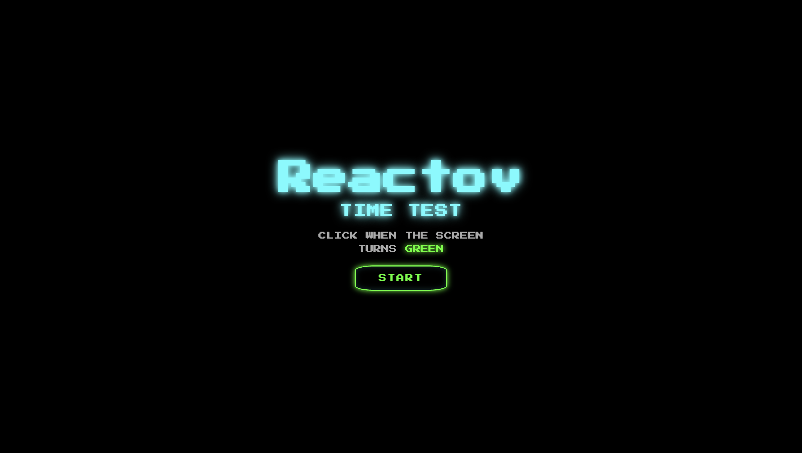
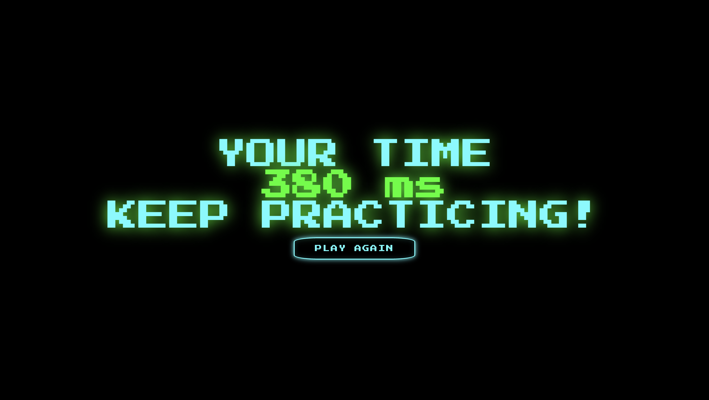

# Reactov ⚡

**Reactov** stands for  
👉 **REACTion On Viewing**

A fast-paced **reaction time web game** built with **React + Vite**, designed to test how quickly a user responds to visual cues.

---

## 🎮 About the Game

- Press **START**
- Screen turns **RED** → wait
- When it turns **GREEN**, click as fast as you can
- Clicking too early results in **Too Soon**
- Final screen displays your **reaction time** with fun feedback

---

## 🖼️ Screenshots

<p align="center">
  
  
</p>

---

## ✨ Features

- Real-time reaction timer
- Fun performance feedback
- Sound effects for start, success, and false start
- Clean UI with animated background
- Built using modern React practices

---

## 🛠️ Tech Stack

- React
- Vite
- JavaScript
- CSS

---

## 📦 Clone & Run the Project

```bash
git clone https://github.com/shritij26/reactov.git
cd reactov
npm install
npm run dev
